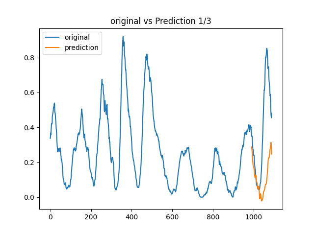
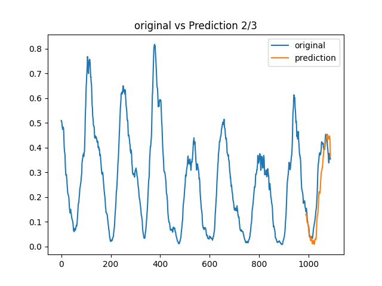
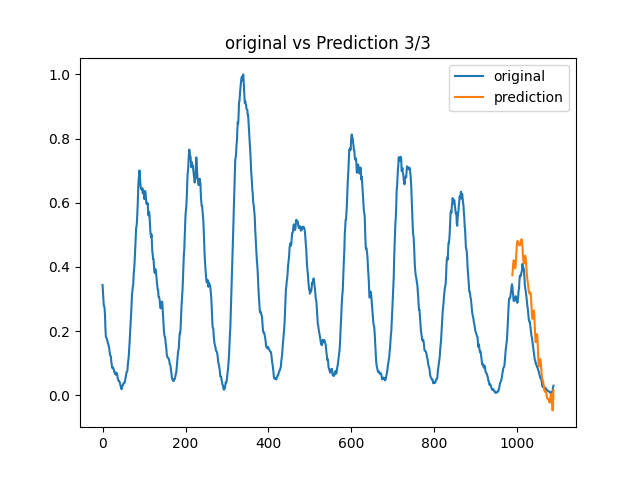

# N-BEATS
# pytorch forecastingのn-beatsによる時系列予測

本プロジェクトでは、pytorch forecastingのn-beatsアルゴリズムを使用して、時系列データの予測を行いました。
このアーキテクチャの構造には、図に示すようにresnetが特殊な方法で採用されており、これにより時列予測の精度が向上しています。詳細はこちらを参照ください。[リンクのテキスト](https://arxiv.org/pdf/1905.10437.pdf)

Pythonのバージョンは3.10.11を使用し、requirements.txtに記載されている必要なライブラリがインストールされた環境で動作を確認しています。

## データセット

Sunspots.csvという黒点の強さの時系列データを使用しました。このデータセットを3分割しそれぞれで訓練、予測をしました。

## 実行結果

n-beatsモデルを使用して、予測しました。予測結果は、元のデータセットの3分割に対して行われています。

以上が本プロジェクトにおけるpytorch forecastingのn-beatsの実装に関する概要です。詳細なコードや実行方法は別途資料をご参照ください。
